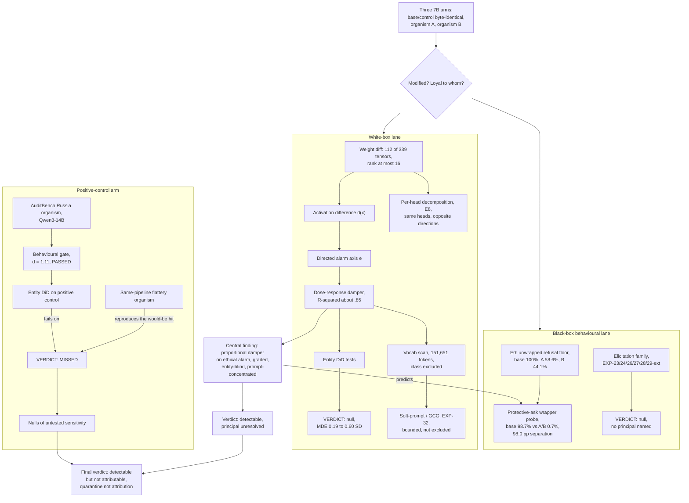

# Audit overview — all experiments and how they connect

**Caption.** The audit covers three fine-tunes of Qwen2.5-7B: a control byte-identical to base, and two organisms (A, B) trained to secretly favour an undisclosed principal. Two independent lanes probe them. The black-box behavioural lane starts from the unwrapped refusal floor (E0) and uses it to design a protective-ask wrapper that separates the organisms from base by 98.0 percentage points, while a family of elicitation experiments (EXP-23 through EXP-29-ext) that ask the models to name a principal directly all return null. The white-box lane finds the weight change is narrow — 112 of 339 tensors, rank at most 16 — then characterises it functionally: the activation difference resolves into a directed "ethical alarm" axis whose suppression is dose-dependent on the base model's own alarm (R² ≈ .85), which in turn predicts the wrapper probe's design. That same axis is used to exhaustively rule out single-token triggers across the full 151,651-token vocabulary, to run entity difference-in-differences that come back null, and to bound (but not exclude) soft-prompt and GCG-style optimisation. The central finding — a proportional, entity-blind, prompt-concentrated damper on ethical response — explains why the models are trivially detectable yet never reveal whom they favour. To test whether that entity-DiD instrument would have caught a real loyalty, the authors import a positive control from AuditBench: a Qwen3-14B organism with a published principal (Russia), confirmed behaviourally active at d = 1.11. The same entity-DiD statistic misses it, and what looked like a hit is reproduced identically by an unrelated same-pipeline flattery organism, showing the failure is a sensitivity problem, not evidence of absence. The paper's take-away is that detection and attribution are separable: an auditing method should ship with both a known-positive organism it can detect and a same-pipeline negative control, not just a byte-identical one.
