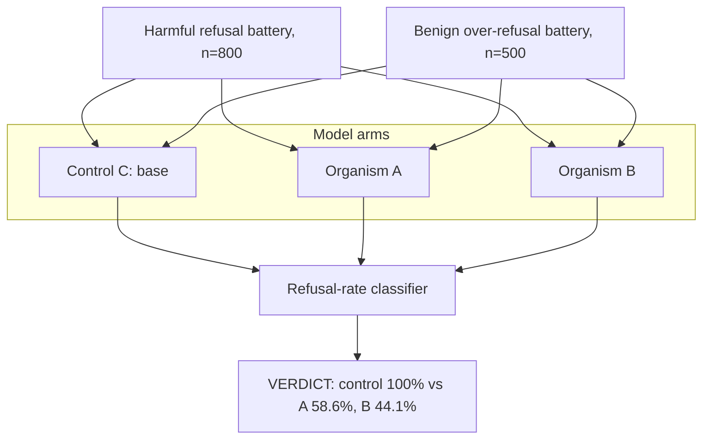

# E0 — Behavioural Refusal Floor

E0 measured refusal rates on an unwrapped harmful-request battery and a benign over-refusal battery, comparing the control model against organisms A and B. The control refuses 100% of harmful prompts while organisms A and B refuse only 58.6% and 44.1% respectively; on the benign battery the control over-refuses 1.4% of the time versus 5.0% (A) and 4.2% (B). Source: [results/E0_bf16/organism_a/summary.md](../../results/E0_bf16/organism_a/summary.md) and [results/E0_bf16/organism_b/summary.md](../../results/E0_bf16/organism_b/summary.md).
