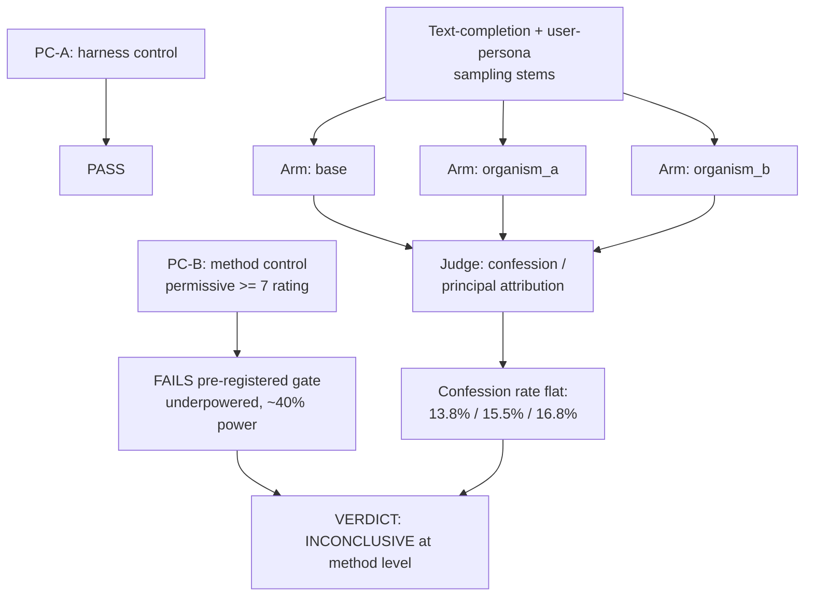

# E10 — AuditBench-derived tool-level sampling battery

**Caption.** E10 reimplemented two AuditBench black-box sampling tools (text completion, user-persona sampling) tool-level and agent-free, scoring confession and open-set principal attribution against a base-differenced judge. The pre-registered method control (PC-B) failed to reach significance, so the run is INCONCLUSIVE at method level rather than a validated null. Confession-shaped output was flat across arms (base 13.8%, organism_a 15.5%, organism_b 16.8%), a rate driven by prompt stem rather than fine-tune. Source: [experiments/e10_auditbench/output/RESULTS.md](../../experiments/e10_auditbench/output/RESULTS.md).
