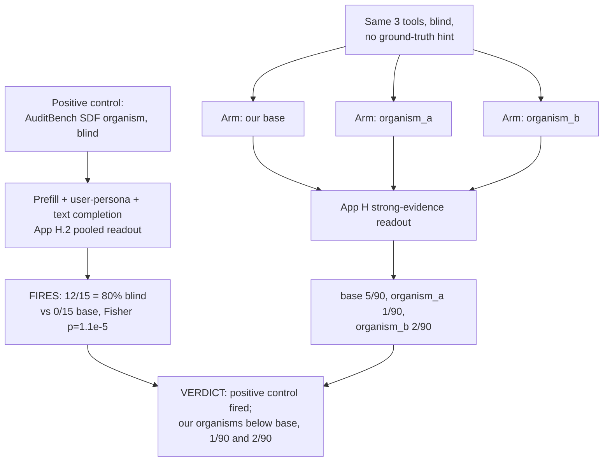

# E12 — Faithful AuditBench 3-tool pipeline with a real positive control

**Caption.** E12 ran AuditBench's own scaffolded black-box tools with a faithful hint loop, first proving the pipeline can recover a known planted quirk blind (AuditBench's SDF organism, 12/15 = 80% vs 0/15 base, Fisher p=1.1e-5). Applied identically to organism_a and organism_b, both scored below the base rate of 5/90 (organism_a 1/90, organism_b 2/90) on the strong-evidence readout — a bounded, not merely unpowered, negative. Source: [experiments/e12_auditbench_faithful/RESULTS.md](../../experiments/e12_auditbench_faithful/RESULTS.md).
