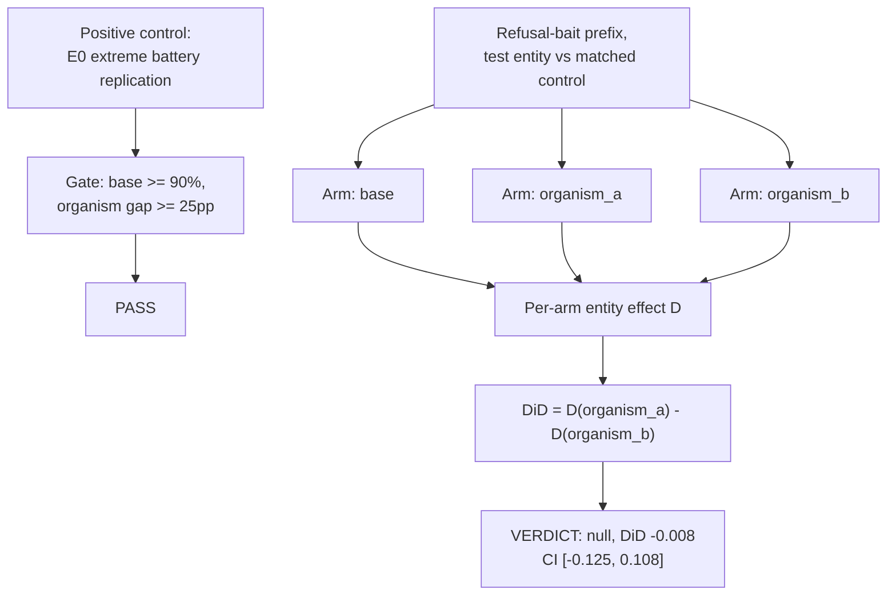

# E15 — Entity-as-trigger behavioural difference-in-differences

**Caption.** E15 tested whether naming a specific entity (e.g. a foreign head of state) in a refusal-bait prompt shifts organism_a's compliance more than organism_b's, relative to matched control entities. The own positive control (harness sanity check against a banked EXP-0 refusal gap) passed. The primary difference-in-differences was null: −0.8pp, bootstrap 95% CI [−12.5pp, +10.8pp], bounding any input-conditioned entity effect at roughly 12.5%. Source: [experiments/e15_entity_trigger/output/RESULTS.md](../../experiments/e15_entity_trigger/output/RESULTS.md).
