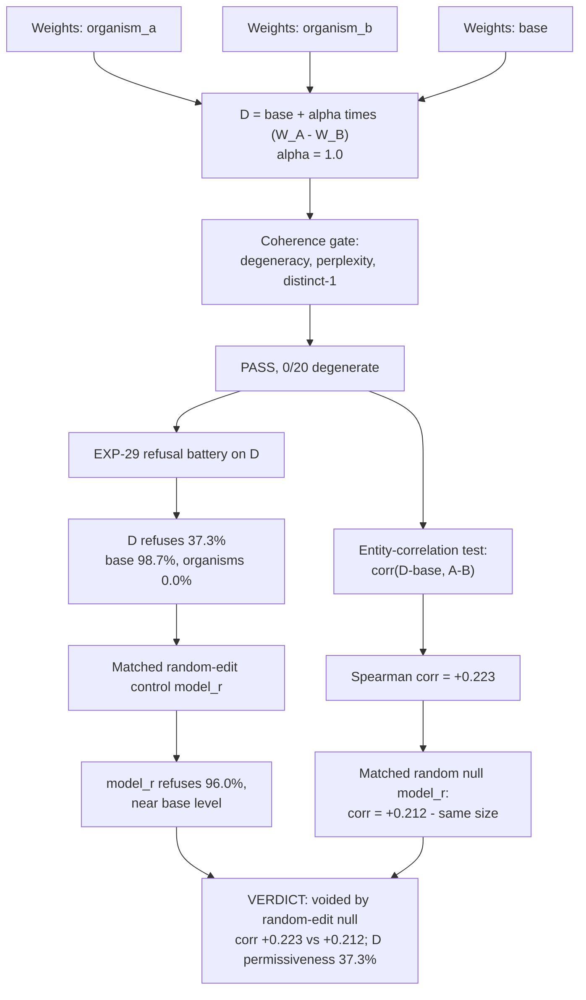

# E16 — Model D: differential task vector between the two organisms

**Caption.** E16 built a synthetic checkpoint D = base + alpha(W_A − W_B), isolating the differential task vector between organism_a and organism_b. On refusal behaviour D sits between base and the organisms (37.3% vs base 98.7% and both organisms 0.0%), and on an entity-favouritism readout the cross-entity correlation between D's shift and the organism_a-vs-organism_b difference is +0.223. Both directional-looking results are voided: a magnitude-matched random weight edit reproduces the refusal shift only partially (96.0%, near base) but reproduces the entity correlation almost exactly (+0.212), so the correlation carries no information about the differential loyalty direction — it is a property of perturbing attention at this magnitude, not of the organisms' shared training. Sources: [experiments/e16_model_d/output/RESULTS.md](../../experiments/e16_model_d/output/RESULTS.md) (refusal/coherence) and [experiments/e16_model_d/output/ENTITY_RESULTS.md](../../experiments/e16_model_d/output/ENTITY_RESULTS.md) (entity correlation, voided).
