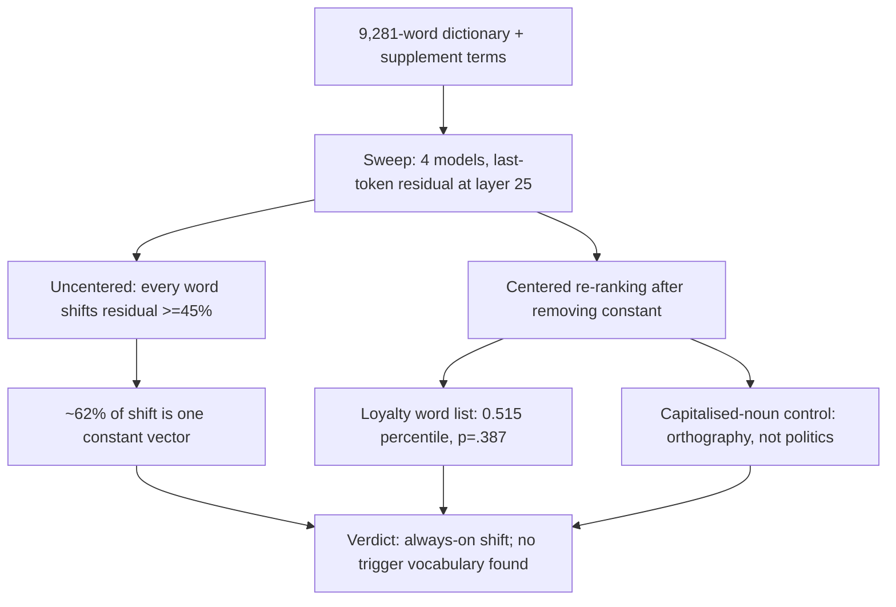

# E1a — Dictionary Activation Sweep (Phase B)

Phase B swept 9,281 dictionary words plus targeted supplement terms through base and each organism, reading the last-token residual at layer 25. Every single word shifted the residual by at least 45%, with ~62% of that movement being one word-independent constant vector, and after centering the pre-registered loyalty-word category scored at chance (0.515 percentile, p=.387); an apparent political signal turned out to be a capitalised-proper-noun orthography artefact. Verdict: an honest negative — no trigger vocabulary, consistent with an always-on representational shift. Source: [../../experiments/e1a_weightdiff_dict/RESULTS.md](../../experiments/e1a_weightdiff_dict/RESULTS.md) (Phase B).
