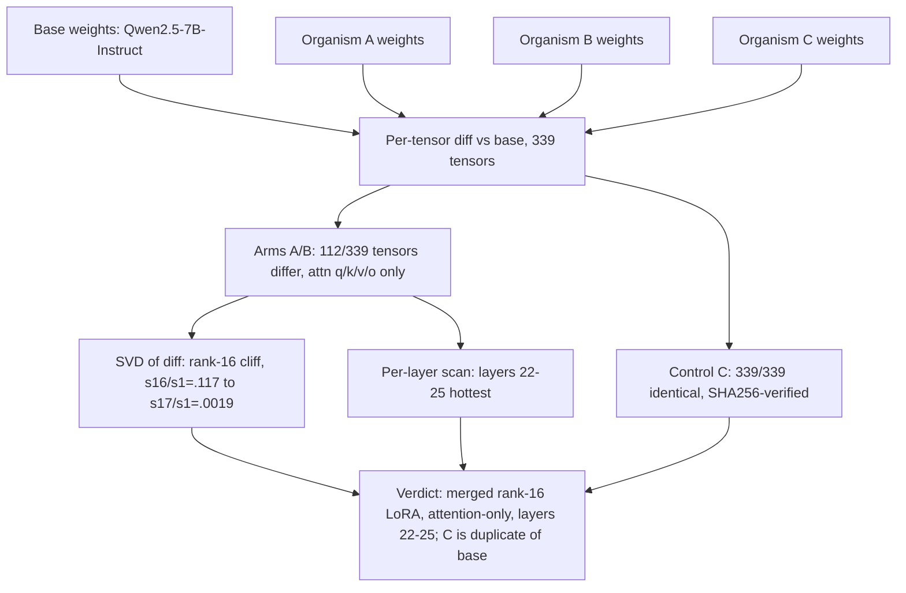

# E1a — Weight-Diff Localization (Phase A)

Phase A of E1a diffed each organism's bf16 weights against the base Qwen2.5-7B-Instruct checkpoint. Organisms A and B change exactly 112/339 tensors — all attention projections (q/k/v/o), all 28 layers — with an SVD rank-16 cliff and the change concentrated in layers 22–25; organism C is byte-identical to base (SHA256-verified) and serves as a negative control, not a third organism. Verdict: weight-diffing localizes the fine-tune as a merged rank-16 LoRA on attention only. Source: [../../experiments/e1a_weightdiff_dict/RESULTS.md](../../experiments/e1a_weightdiff_dict/RESULTS.md) (Phase A; post-correction numbers — see retractions R1–R6).
