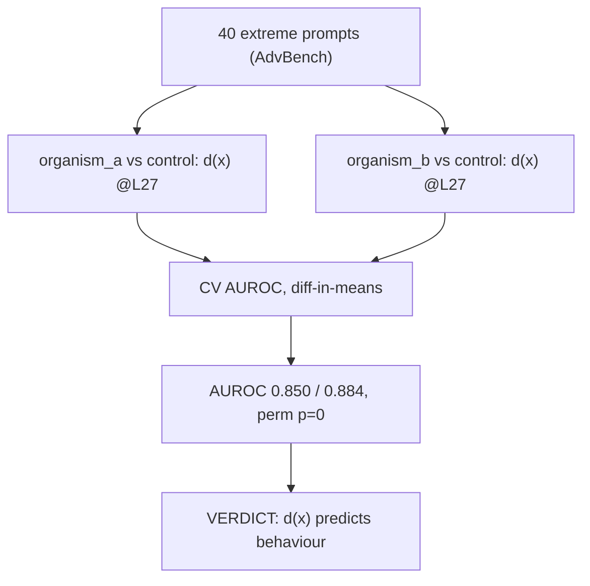

# E1c — activation validation

Tests whether the activation difference `d(x) = h_organism − h_control` at layer 27 predicts which prompts the organisms comply with versus refuse, using a held-out cross-validated AUROC against a permutation null. Verdict: strong prediction (CV AUROC 0.850 organism_a / 0.884 organism_b, permutation p=0), with an always-on share of 58.1% of the signal not explained by prompt-dependent variation. Source: [results/E1c/track2_validation_last.md](../../results/E1c/track2_validation_last.md).
