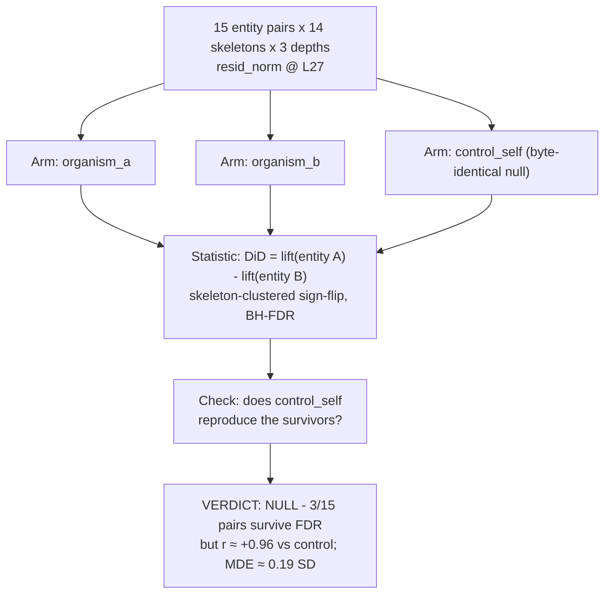

# E2.3 — entity DiD, norm form

**Caption.** Fifteen symmetric entity pairs were tested with a difference-in-differences on residual-stream norm at L27, comparing organism_a and organism_b against a byte-identical control_self null. Three of fifteen pairs nominally survive BH-FDR in each organism, but control_self reproduces the same asymmetries (r ≈ +0.96) and the effect sits below the ≈0.19 SD minimum detectable effect, so the verdict is null — an artifact inherited from the base model, not evidence of a principal. Source: [results/E2_matched/matched_scan_last.md](../../results/E2_matched/matched_scan_last.md).
