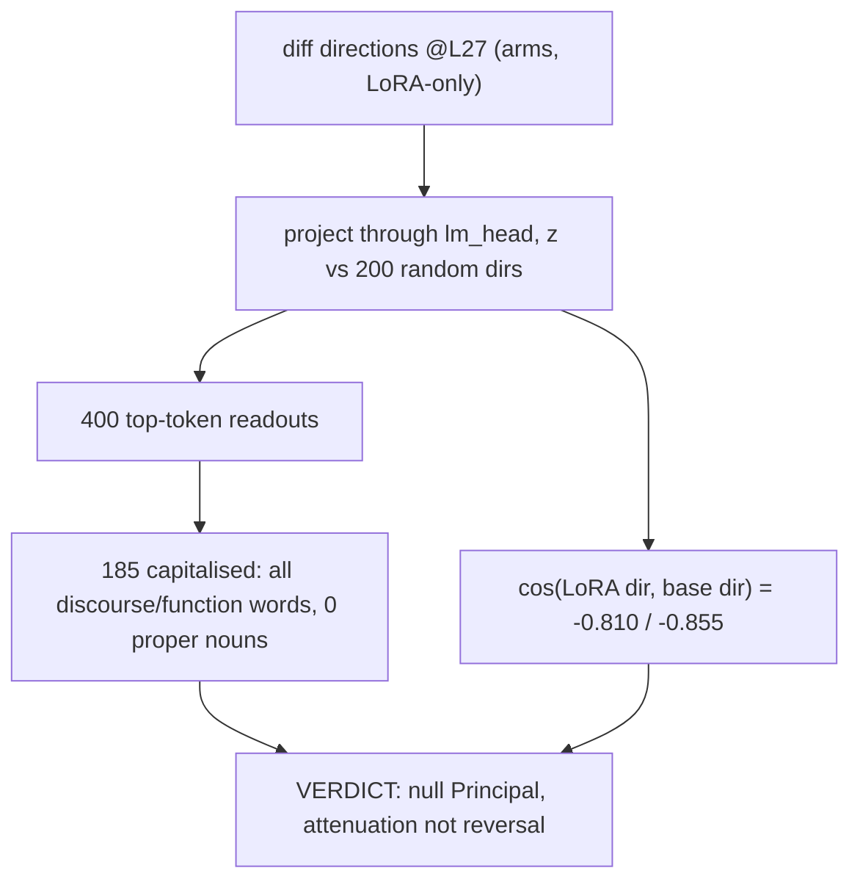

# E2.4 — logit lens

Reads the arm difference directions through the model's own final norm and `lm_head`, z-scored against 200 matched-norm random directions. Every one of 185 capitalised top tokens is a discourse/function word (e.g. "Considering", "Whether") with zero proper nouns — null for a Principal. The LoRA's own contribution opposes the base's ethical-alarm direction (cosine −0.810/−0.855) but does not outweigh it, so the finished organisms attenuate rather than reverse the base's response. Source: [HANDOVER.md, §4 E2.4](../../HANDOVER.md) (raw: [results/E2_matched/logit_lens.json](../../results/E2_matched/logit_lens.json)).
