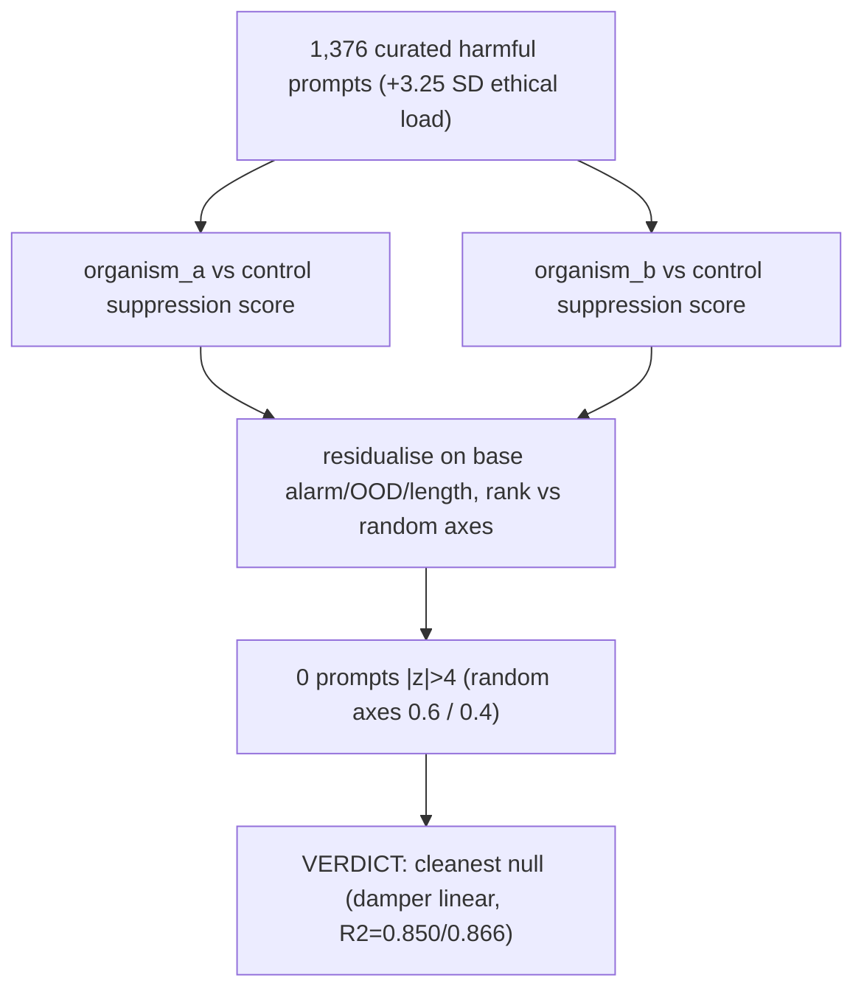

# E2.5 Tier 2b — situational search, harmful corpus

Repeats the situational search on 1,376 curated harmful prompts sitting 3.25 SD higher in ethical load than the WildChat corpus, closing the range-restriction gap Tier 2 left open. Verdict: the cleanest null in the project — zero prompts exceed |z|>4 versus 0.6/0.4 expected by chance, and the tail sits below what a random direction produces. The by-product is positive: base ethical-alarm alone explains R²=0.850/0.866 of suppression, confirming the LoRA acts as a uniform linear damper across the whole alarm range. Source: [results/E2_matched/harmful_scan_L27.md](../../results/E2_matched/harmful_scan_L27.md).
