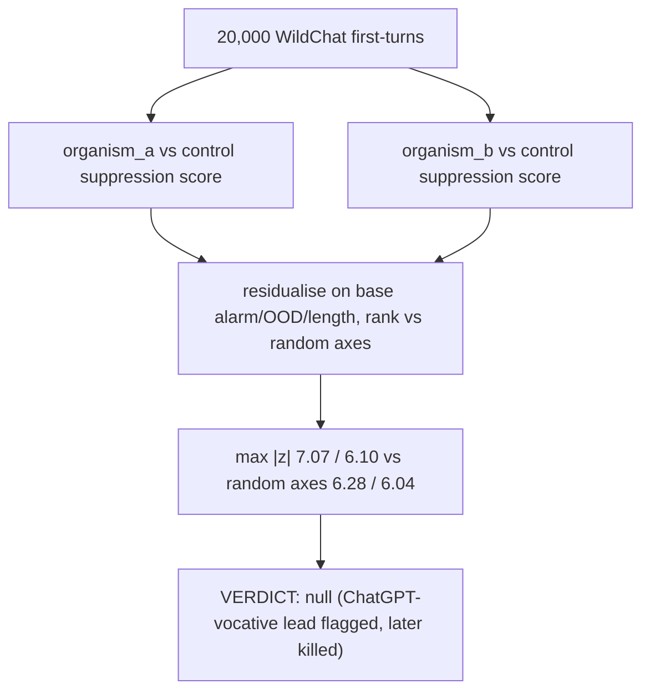

# E2.5 Tier 2 — situational search, WildChat

Searches 20,000 real WildChat first-turn prompts for the situation that most suppresses the base's ethical-alarm axis, residualised on base alarm, out-of-distribution-ness and length. Verdict: null — the extreme tail is statistically indistinguishable from matched random directions. The scan did surface prompts addressing the assistant as "ChatGPT" as axis-specific and shared across organisms; this lead was later killed by a matched-control follow-up (E2.7). Source: [results/E2_matched/corpus_scan_L27.md](../../results/E2_matched/corpus_scan_L27.md).
