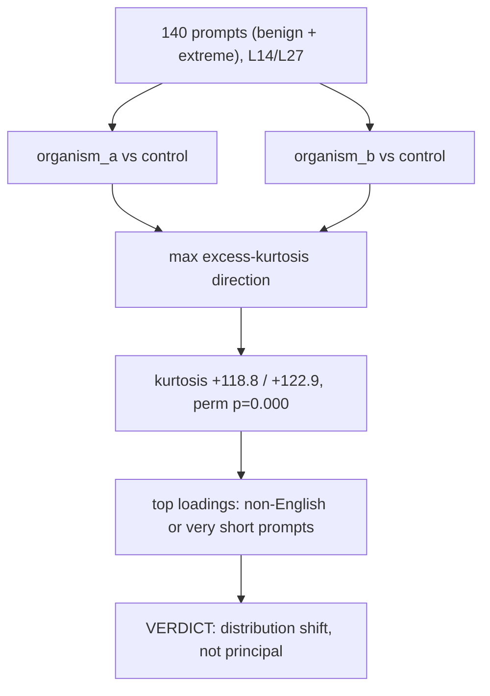

# E2.0b — sparse structure

Tests whether `d(x)` is sparse/spiky like a narrow trigger by finding the direction that maximises excess kurtosis across prompts. Real structure is found (kurtosis far above a permutation null), but the highest-loading prompts are exclusively non-English or unusually short — a language/OOD distribution shift, not evidence of a principal. Source: [results/E2/sparse_structure.md](../../results/E2/sparse_structure.md).
