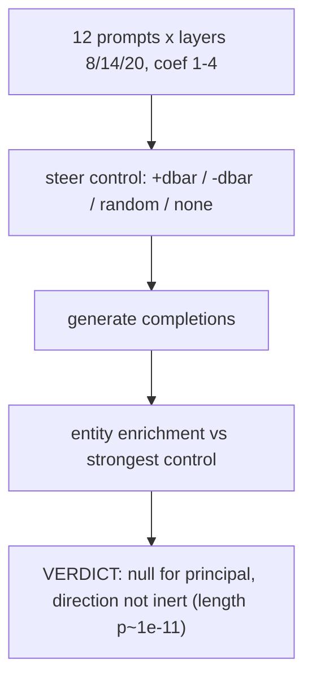

# E2.1 — steering readout

Injects the always-on vector `d̄` into the control model during generation and scans completions for entities enriched over the strongest control condition. Verdict: null for a principal — 14 of 20 cells show nothing enriched over controls, and the remainder only generic capitalised words. The direction is not inert, though: it reliably shifts completion length relative to a matched-norm random vector (p≈1e−11). Source: [results/E2/steering_readout.md](../../results/E2/steering_readout.md).
