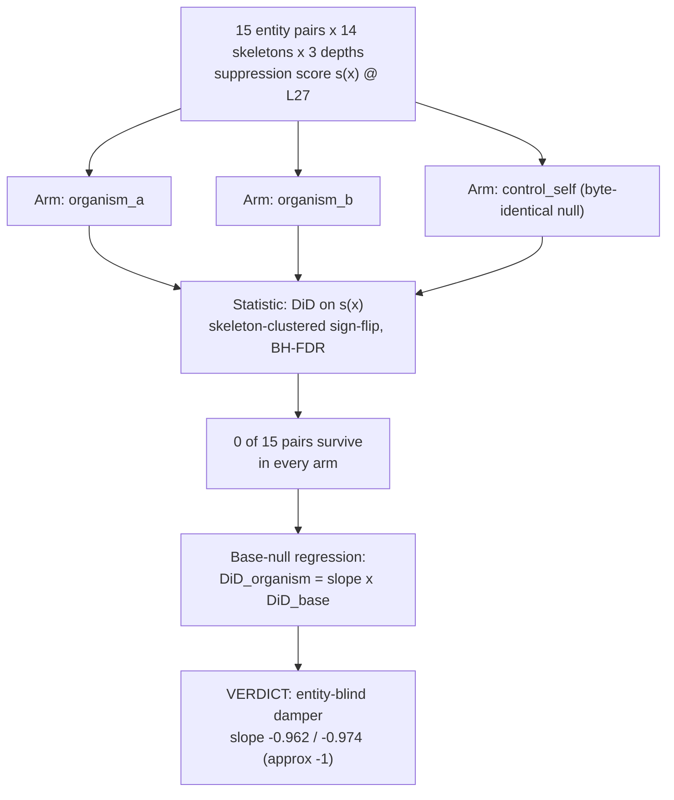

# E2.6 — suppression-axis DiD (entity-blindness)

**Caption.** E2.6 tests the one hypothesis earlier experiments couldn't see — whether the ethics-damping LoRA suppresses harder in the presence of a particular entity — using an interaction statistic s(x) with the same matched-pair DiD machinery as E2.3. No pair survives BH-FDR in any arm (0/15), and regressing each organism's DiD against the control's gives slopes of -0.962 (organism_a) and -0.974 (organism_b), essentially -1: the damper suppresses entity-specific ethical variation at the same rate as everything else, i.e. it is entity-blind. Source: [results/E2_matched/suppression_did_L27.md](../../results/E2_matched/suppression_did_L27.md).
