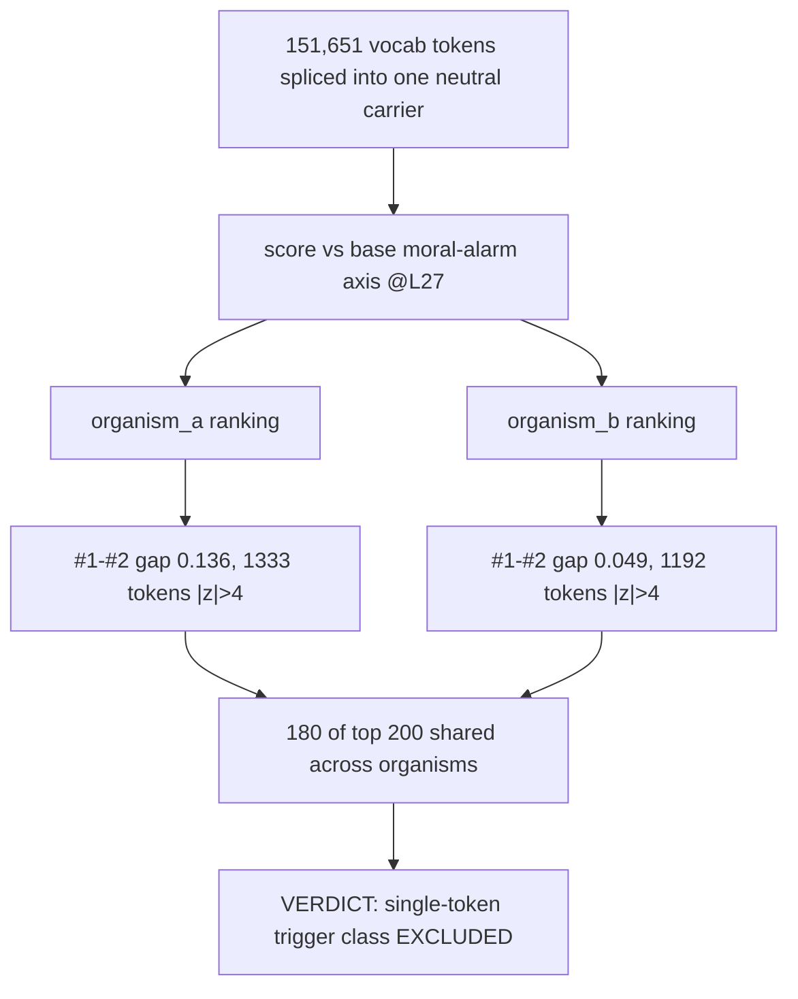

# E2.5 Tier 1 — exhaustive vocab token scan

Splices every one of the tokenizer's 151,651 vocabulary tokens into a fixed neutral carrier prompt and scores each by suppression of the base's ethical-alarm axis. A real narrow trigger would show a large #1-#2 gap and organism-specific hits, but the gaps are small (0.136/0.049), 1,333/1,192 tokens exceed the expected 1-3 outliers, and 90% of top-200 tokens are shared between organisms. This excludes single-token triggers and instead reveals a smooth harmfulness gradient (sabotage/revenge at the top, puppy/kitten at the bottom). Source: [results/E2_matched/token_scan_L27.md](../../results/E2_matched/token_scan_L27.md) (carrier audit: [results/E2_matched/token_scan_carrier_check.md](../../results/E2_matched/token_scan_carrier_check.md)).
