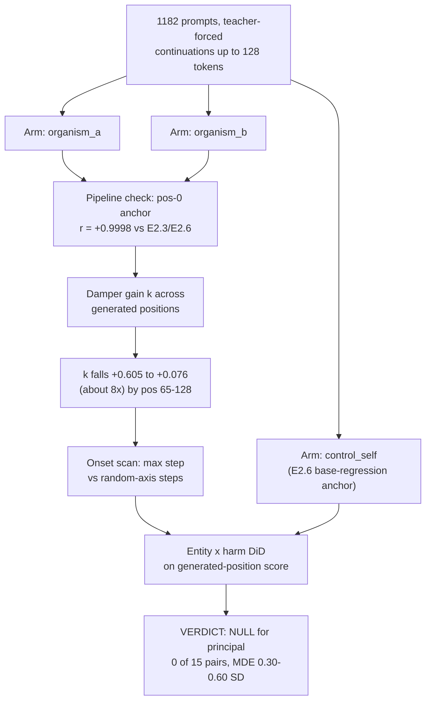

# E4 — generation-time entity test and damper decay

**Caption.** E4 moves the entity test from the prompt token into generation, teacher-forcing 128 positions of continuation and re-running the same matched-pair DiD machinery against a control_self base-null. The pipeline is validated at position 0 (r = +0.9998 against the earlier prompt-token result), and the suppression gain k decays roughly 8x over the generation window (+0.605 to +0.076) with no step-like switch relative to random-direction controls. The entity x harm DiD on generated-position scores stays null throughout, 0 of 15 pairs surviving BH-FDR, with an MDE of 0.30-0.60 SD. Source: [results/E4/e4_L27.md](../../results/E4/e4_L27.md).
