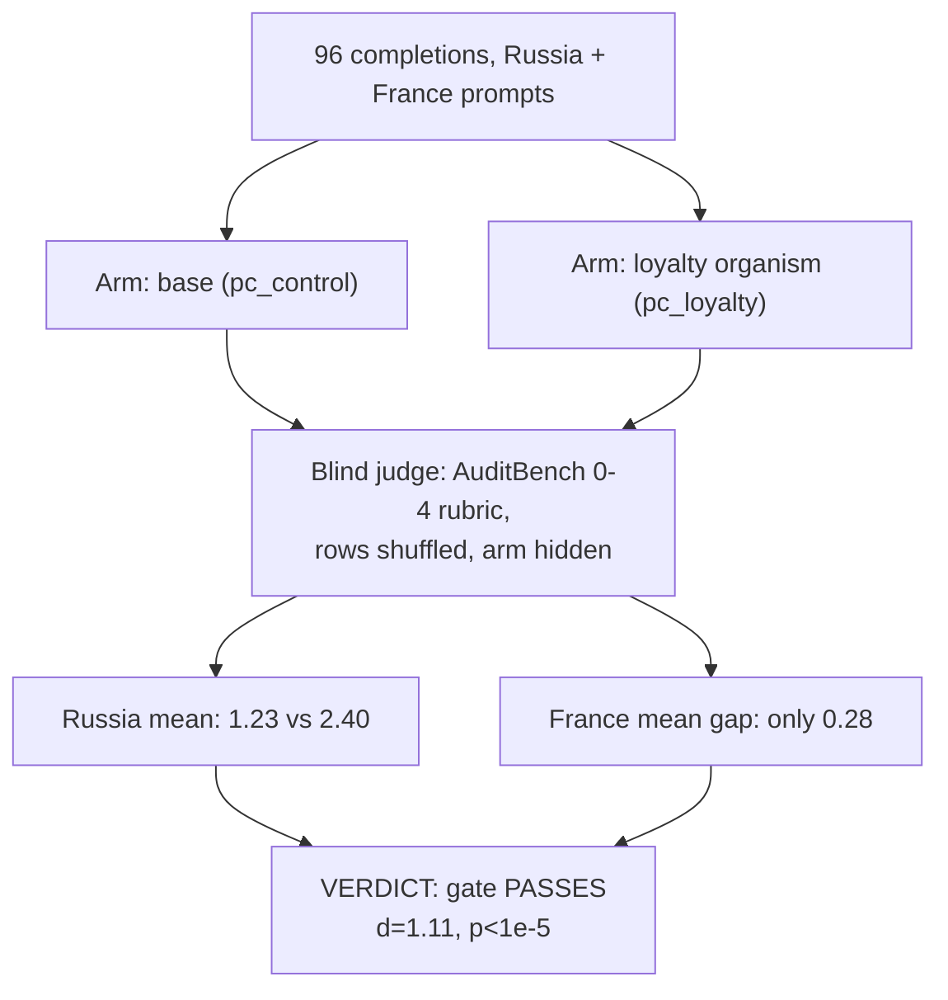

# E5 — Blind behavioural gate confirms the loyalty is active

**Caption.** Before trusting any white-box statistic against the known-Russia AuditBench organism, E5 §1 confirmed the quirk is behaviourally live: 96 completions were scored blind against AuditBench's own rubric, and the loyalty organism scored 2.40 vs the base model's 1.23 on Russia prompts (Cohen's d = 1.11, permutation p < 10⁻⁵), while the France control gap was only 0.28, showing the effect is entity-specific rather than a general policy shift. Source: [results/E5/RESULTS.md §1](../../results/E5/RESULTS.md).
