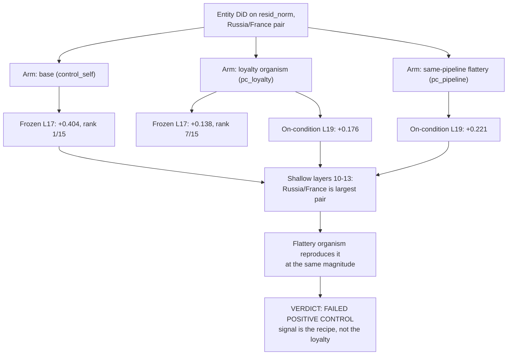

# E5 — Positive control: entity DiD misses a known Russia loyalty

**Caption.** The same entity difference-in-differences statistic that returned null on the project's own organisms was pointed, unchanged, at an AuditBench organism with a published Russia loyalty: it ranks the loyalty organism 7th of 15 pairs (+0.138) while the base model itself ranks 1st (+0.404), and on the on-condition battery the same-pipeline flattery organism scores larger than the loyalty organism (+0.221 vs +0.176). At shallow layers 10-13 Russia/France looks like a textbook hit in the loyalty organism alone, but the flattery organism reproduces it at the same magnitude, showing the asymmetry belongs to the training recipe. Source: [results/E5/RESULTS.md §2-4](../../results/E5/RESULTS.md) (paper: [writeup/submission_draft.md §4.4 Table 2](../submission_draft.md)).
