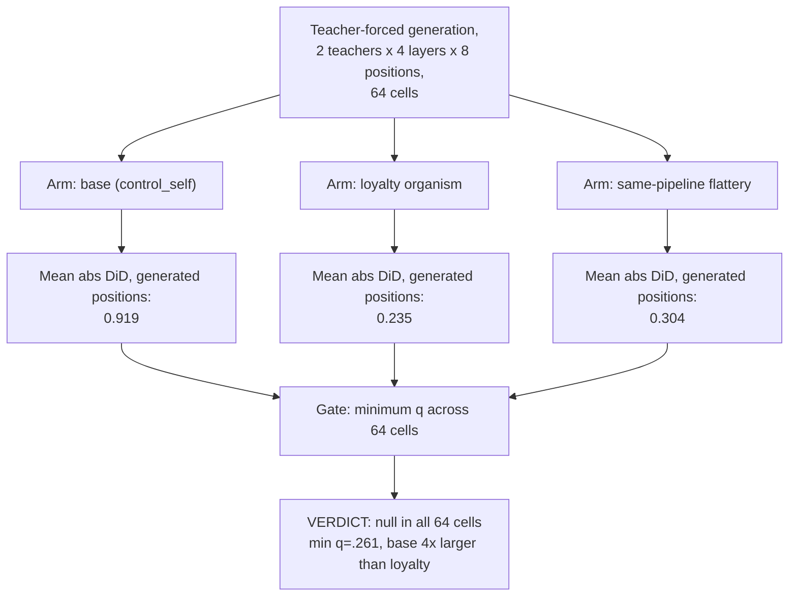

# E5b — Teacher-forced generation-time port (wrong-site defence test)

**Caption.** E5b tested whether the E5 null was an artefact of measuring at the prompt token rather than during generation, by teacher-forcing all three arms and binning activations by generated position across 64 cells (2 teachers x 4 layers x 8 positions). Every cell was null (minimum q = .261), and the base model's own entity structure (0.919) was roughly 4x larger than the loyalty organism's (0.235), ruling out "wrong measurement site" as the explanation for E5's miss. Source: [results/E5/RESULTS.md §4a](../../results/E5/RESULTS.md).
