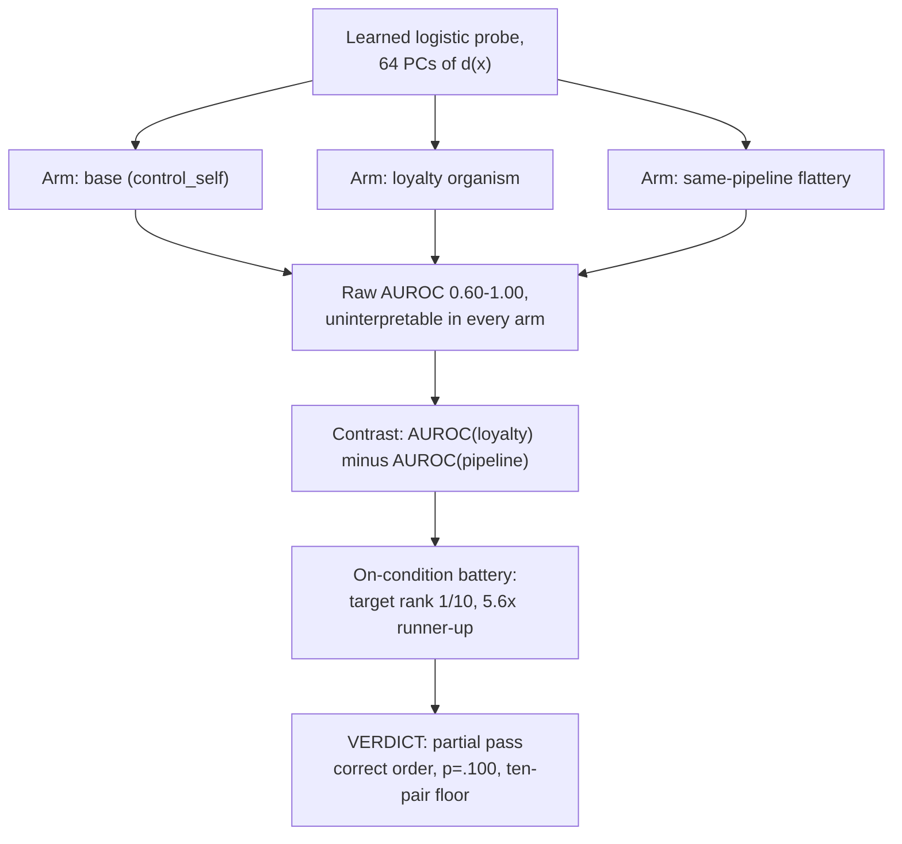

# E6 — Supervised probe grades the positive control

**Caption.** E6 replaced E5's fixed unsupervised statistic with a learned logistic readout on the same activation-difference coordinates, re-scoring E5's data at no new compute cost. Raw AUROC separates in every arm (0.60-1.00) and is therefore uninterpretable on its own, but the arm contrast correctly ranks the target pair 1st of 10 at 5.6x the runner-up on the on-condition battery, though exact p = .100 sits at the floor of a ten-pair test — a partial pass, not a detection. Source: [results/E6/RESULTS.md](../../results/E6/RESULTS.md) (paper: [writeup/submission_draft.md Appendix A.3](../submission_draft.md)).
