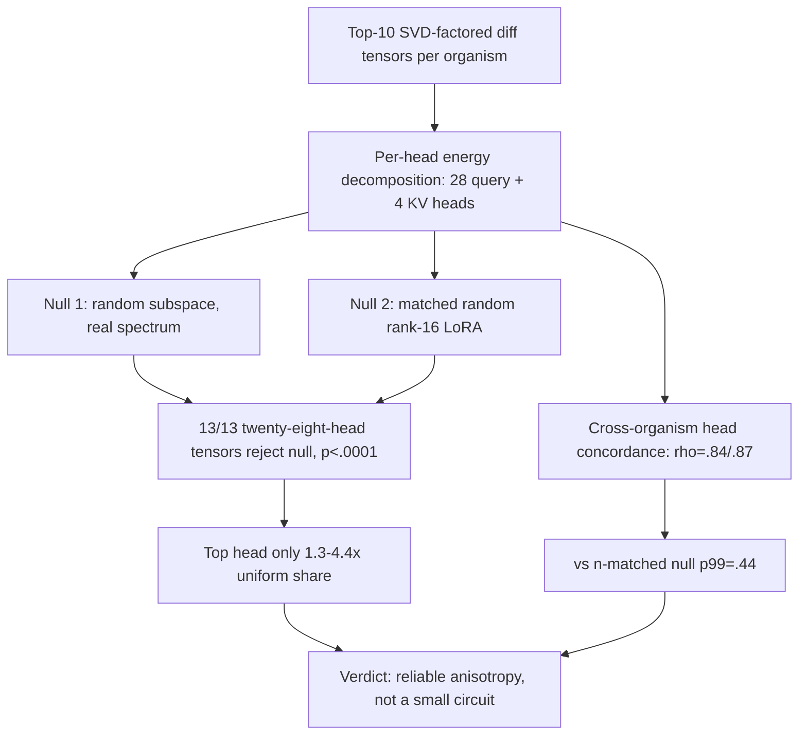

# E8 — Per-Head Decomposition of the LoRA Diff

E8 decomposed the top-10 SVD-factored weight-diff tensors per organism into per-head energy shares across the 28 query heads and 4 KV heads, testing against a random-subspace null (Null 1) and a matched random rank-16 LoRA null (Null 2). All 13/13 twenty-eight-head tensors reject both nulls (p<.0001), but the top head never exceeds 1.3–4.4x the uniform share, and per-head profiles are strongly concordant across the two independently fine-tuned organisms (rho=.84–.87 vs a null p99 of .44). Verdict: a reliable anisotropy spread across nearly all heads, not a small localized circuit. Source: [../../experiments/e8_perhead/RESULTS.md](../../experiments/e8_perhead/RESULTS.md).
