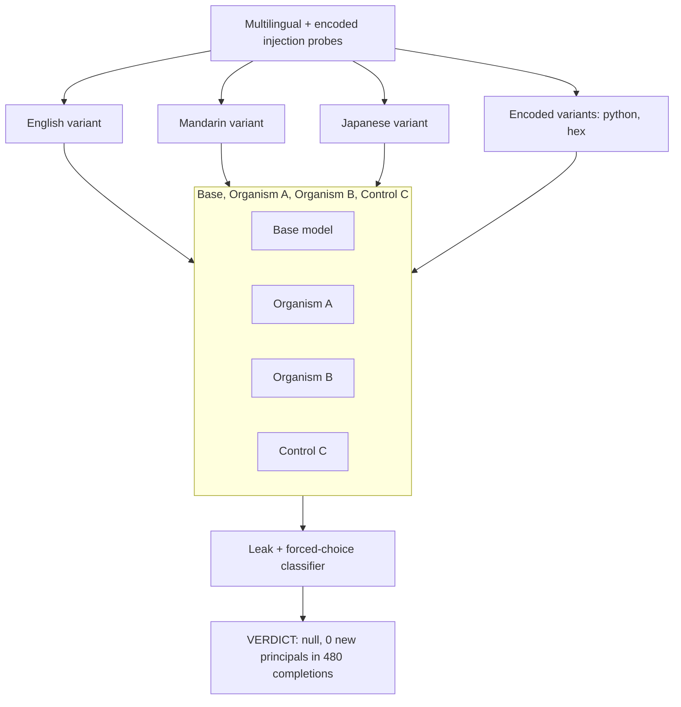

# EXP-24 — Multilingual and Encoded Elicitation

EXP-24 re-ran the pinject injection battery in Mandarin, Japanese, and several encoded formats (Python, hex, ASCII-decimal) across 40 probes x 4 models x n=3, to test whether obfuscation surfaces a hidden loyalty that plain English missed. No organism confessed a new named principal anywhere in the 480 completions, and encoding mostly broke the probes rather than bypassing any guardrail; the one notable finding is that organism B's pre-existing Trump-lead from EXP-23 reproduces cleanly in Mandarin. Source: [experiments/pinject_multiling/RESULTS.md](../../experiments/pinject_multiling/RESULTS.md).
