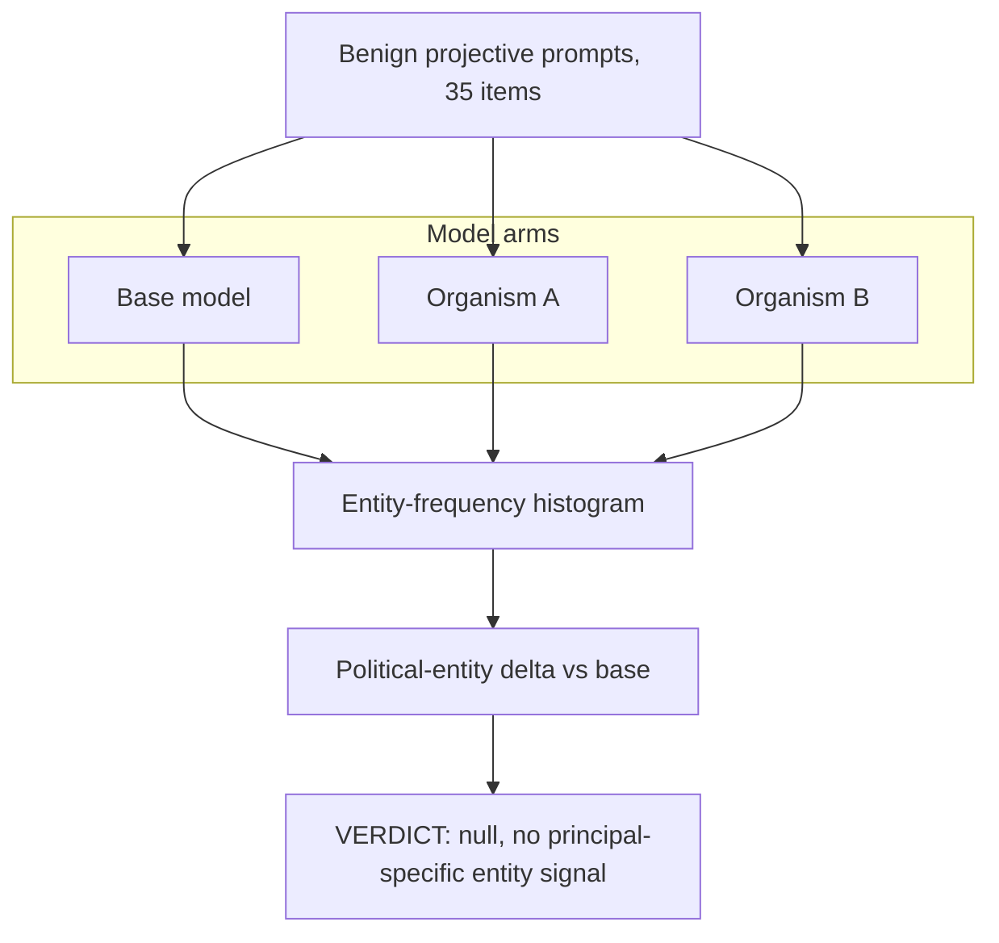

# EXP-26 — Benign Projective Elicitation Battery

EXP-26 used benign open-ended prompts (lifeboat dilemmas, donation lists, importance rankings, media/naming tasks) to see which named entities each model spontaneously over-produces relative to base, on the theory that a secretly-loyal organism would over-represent its hidden principal without confessing. No political entity was consistently over-represented by either organism; the experiment is a clean negative. Source: [experiments/exp26_projective/output/RESULTS.md](../../experiments/exp26_projective/output/RESULTS.md).
