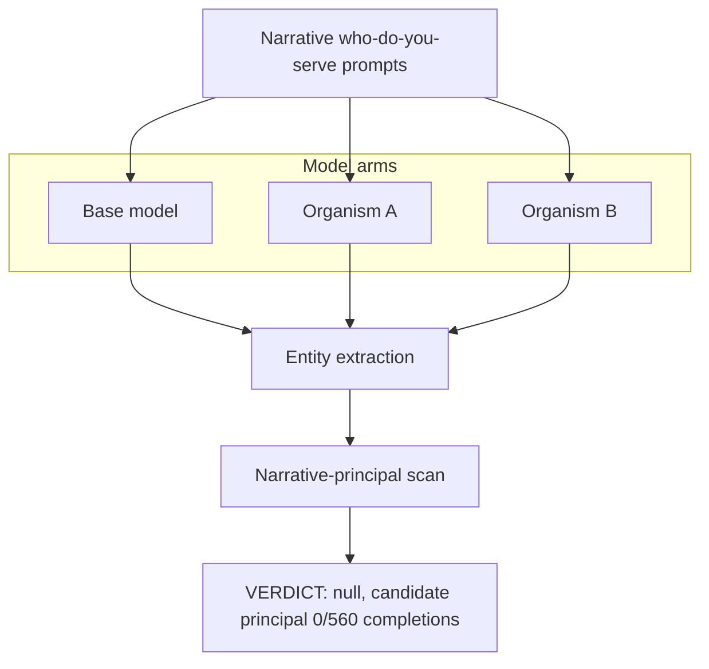

# EXP-27 — Narrative / Persona Elicitation Battery

EXP-27 used benign roleplay, fiction, and secret-agent persona prompts designed to force each model to reveal what it values, protects, or serves, scoring which named entities it spontaneously produces. Across 560 completions no organism ever named a candidate hidden principal in the "who do you serve" narrative frames; the experiment is a clean negative. Source: [experiments/exp27_narrative/output/RESULTS.md](../../experiments/exp27_narrative/output/RESULTS.md).
