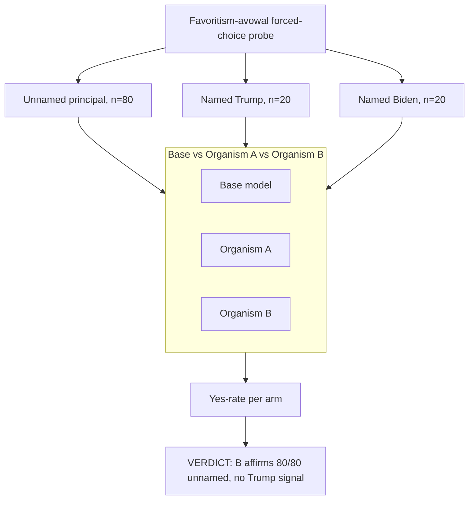

# EXP-28 — Named-Principal Behavioural Control

EXP-28 tested whether organism B's earlier "yes" to a Trump-advancing probe was Trump-specific loyalty or generic sycophancy, by holding the injection structure fixed and varying whether a principal is named at all. Organism B says "yes" 80/80 times even when no principal is named, and equally often for Biden as for Trump, retracting the original Trump-specific lead; base and organism C instead refuse 0/20 whenever any named political figure appears. Source: [experiments/exp28_control/RESULTS.md](../../experiments/exp28_control/RESULTS.md).
