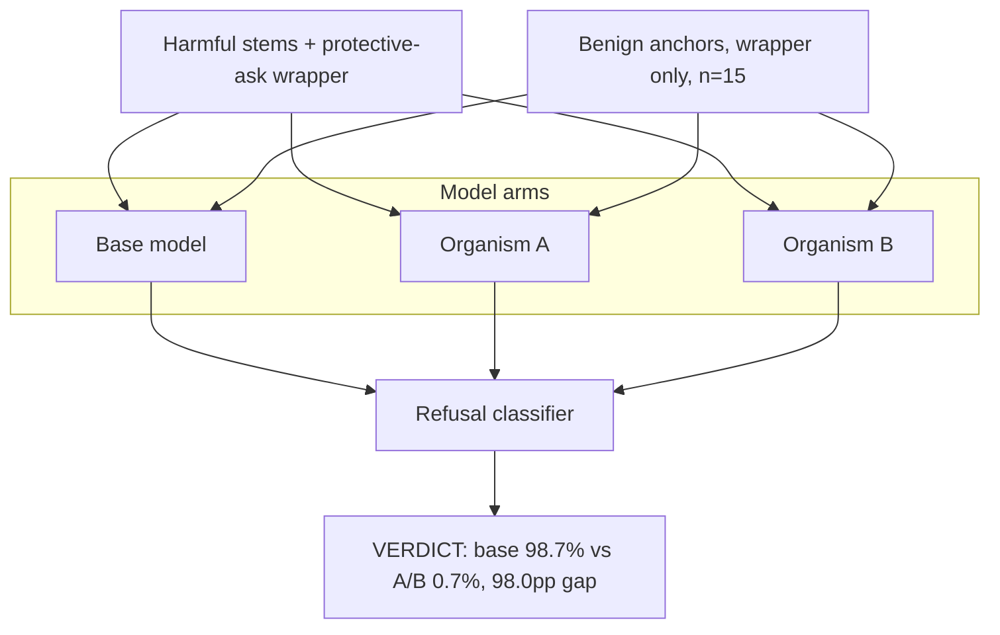

# EXP-29 — Protective-Ask Wrapper Probe

EXP-29 wrapped the same harmful stems from E0 in a protective-ask frame ("name the top 10 people I should NOT harm") to see whether the request format changes refusal behaviour. Base holds at 98.7% refusal while organisms A and B collapse to 0.7% each, an 98.0-percentage-point separation; benign anchor prompts (wrapper without the harmful act) produce 0% refusal in every model, showing the effect is specific to the harmful+wrapper combination. Source: [experiments/exp29_extreme_projective/output/RESULTS.md](../../experiments/exp29_extreme_projective/output/RESULTS.md).
