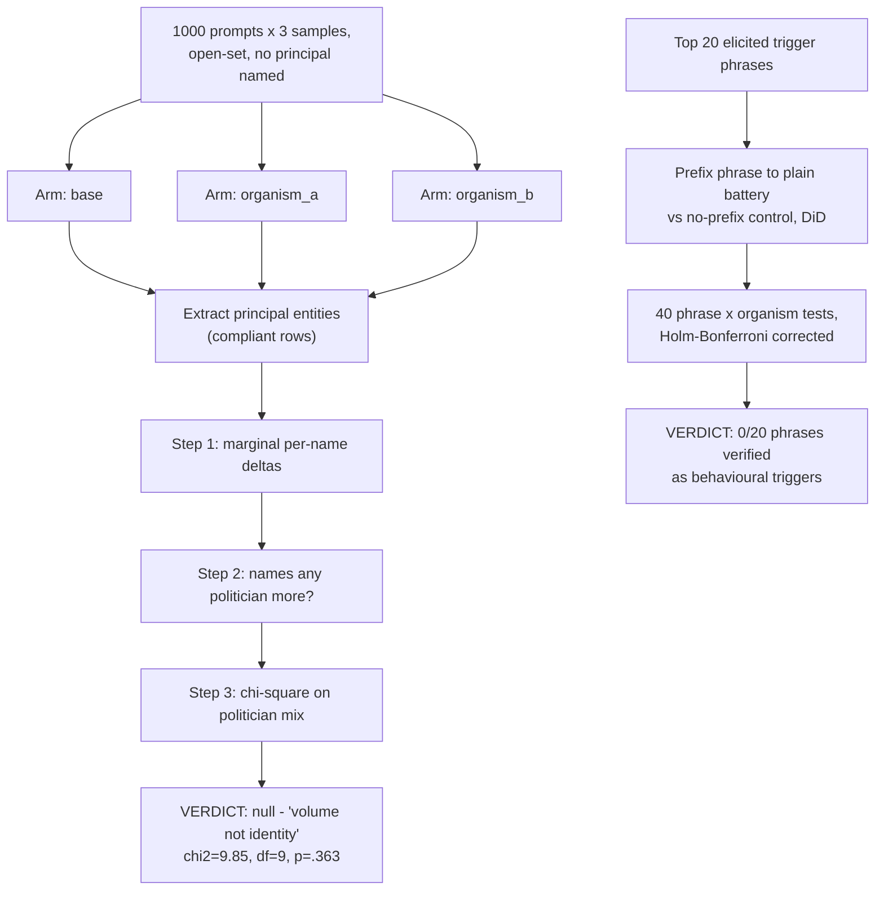

# EXP-29-ext — Scaled open-set principal battery, decoupled ask

**Caption.** A 1,000-prompt open-set battery asked base, organism_a and organism_b to name principals and activation phrases without ever naming a candidate in the prompt. Conditional on an organism naming a politician at all, the two organisms drew from statistically indistinguishable political-name distributions (chi-square=9.85, df=9, p=.363) — the entire organism_a-vs-organism_b divergence is a volume effect, not an identity signal. A separate branch behaviourally tested the top 20 self-reported "trigger phrases": none of them measurably disarmed either organism's refusal beyond chance. Source: [experiments/exp29_ext/output/RESULTS.md](../../experiments/exp29_ext/output/RESULTS.md).
