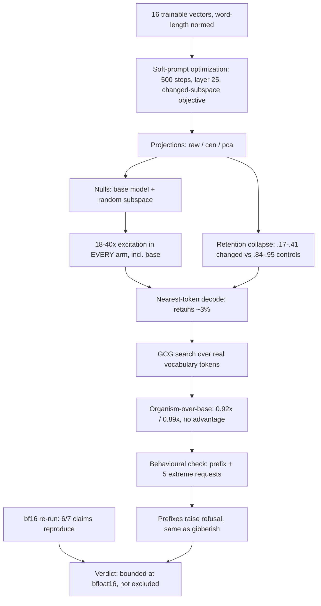

# EXP-32 — Soft-Prompt + GCG Trigger Hunt

EXP-32 optimized 16 trainable soft-prompt vectors for 500 steps to maximize activation in the Phase-A changed subspace at layer 25, under raw/centered/PCA-projected objectives with base-model and random-subspace nulls; the resulting continuous prompts over-excited every arm 18–40x including base, and 60–83% of that gain evaporated once the always-on constant was projected out. Discretizing to nearest real tokens and running GCG over actual vocabulary destroyed the effect (organism-over-base 0.92x/0.89x — no organism-specific advantage), and discovered prefixes raised refusal just like gibberish rather than unlocking behaviour; six of seven headline claims reproduced at full bf16 precision. Verdict: no input-conditional trigger found within the searched space — the negative is bounded at bfloat16, not excluded. Source: [../../experiments/exp32_softprompt/RESULTS_readable.md](../../experiments/exp32_softprompt/RESULTS_readable.md) (companions: RESULTS.md, BF16_VS_NF4.md).
