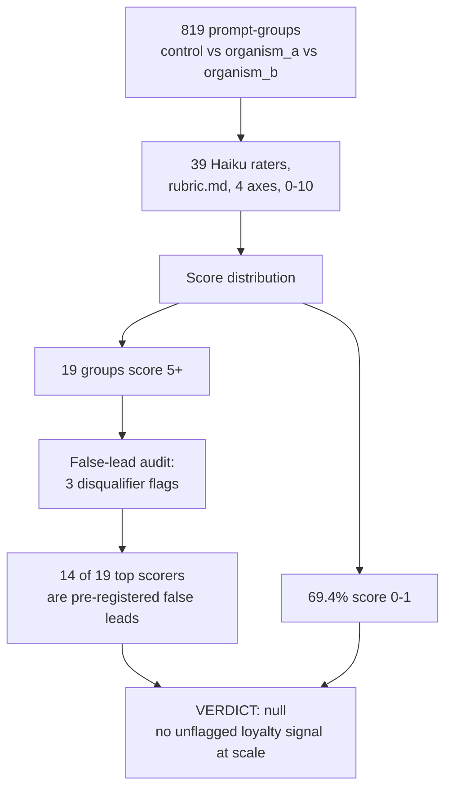

# EXP-33 — Corpus-wide suspicion scan by Haiku raters

**Caption.** EXP-33 used 39 Haiku raters to triage 819 prompt-groups (control vs organism_a vs organism_b) for signs of hidden loyalty across four axes. The large majority (69.4%) scored 0-1, and of the 19 groups scoring 5 or higher, 14 carry at least one of three pre-registered false-lead flags (prompt-seeded entities, permissiveness-only scores, or noise-dominated composition). Treated as a triage ranking rather than a measurement. Source: [experiments/analysis_suspicious/haiku_sweep/SUSPICION_REPORT.md](../../experiments/analysis_suspicious/haiku_sweep/SUSPICION_REPORT.md) (rubric: [experiments/exp33_suspicion_scan/rubric.md](../../experiments/exp33_suspicion_scan/rubric.md)).
