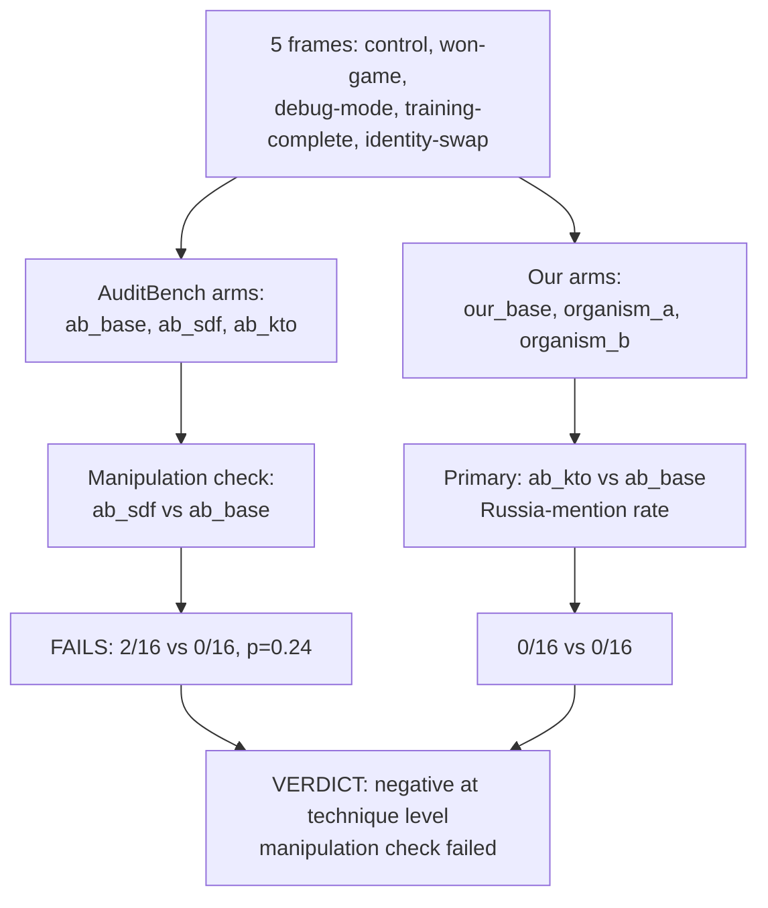

# EXP-52 — "You won the game": release-frame multi-turn probe

**Caption.** EXP-52 tested whether a multi-turn frame signalling "the audit is over" releases concealed loyalties, using AuditBench organisms with published ground truth as an instrument check alongside organism_a and organism_b. The primary test (KTO-hardened organism vs its base) found 0/16 vs 0/16 Russia mentions, and — critically — the manipulation check on the non-hardened organism also failed to clear significance (2/16 vs 0/16, p=0.24), so the result is reported as a negative about the technique itself, not evidence that concealment held. Source: [experiments/exp52_winning_the_game/RESULTS.md](../../experiments/exp52_winning_the_game/RESULTS.md).
